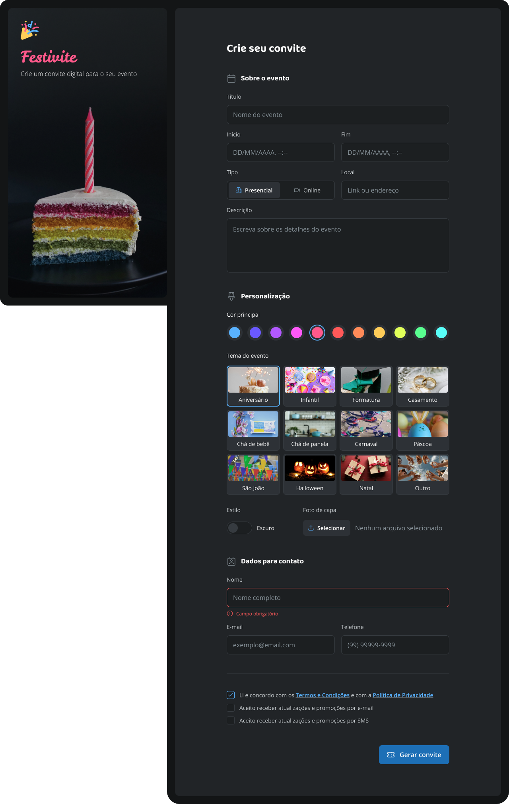

# 🎉 Formulário de Convite

**Formulário de Convite** é uma aplicação web moderna desenvolvida para **simplificar a criação e o gerenciamento de convites digitais para festas e aniversários**. O projeto prioriza **usabilidade**, **clareza na coleta de informações** e **feedback visual imediato**, garantindo uma experiência intuitiva tanto para quem cria quanto para quem recebe o convite.

---

## 🧭 Sobre o Projeto
A interface foi pensada para conduzir o usuário de forma **linear e objetiva**, reduzindo erros no preenchimento e facilitando a personalização do convite. O layout combina **identidade visual festiva**, **hierarquia tipográfica bem definida** e **componentes interativos**, adequados ao contexto de eventos comemorativos.

O layout apresenta:

- 🎂 **Cadastro completo do evento**: nome da festa, tipo (aniversário, comemoração, evento temático), data e horário  
- 📍 **Informações de local**: endereço, ponto de referência ou link para mapa  
- 👤 **Dados do anfitrião**, incluindo formas de contato  
- ✉️ **Validação de campos em tempo real**, com feedback visual para erros  
- 🎨 **Escolha de tema e estilo do convite** por meio de cards interativos  
- 📎 **Upload de imagens**, como foto do aniversariante ou arte personalizada  
- 📝 **Mensagem personalizada** para os convidados  
- 🔐 **Aceite de Termos e Política de Privacidade**
- ...

---

